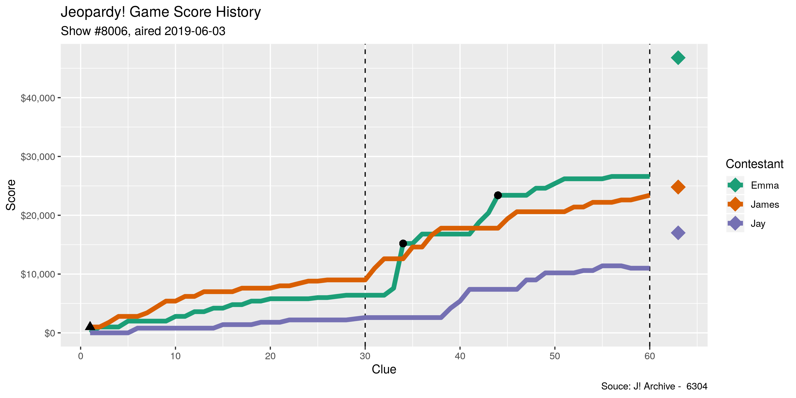

<!-- README.md is generated from README.Rmd. Please edit that file -->

# whatr 

<!-- badges: start -->

[](https://www.tidyverse.org/lifecycle/#experimental)
[](https://CRAN.R-project.org/package=whatr)
[](https://travis-ci.org/kiernann/whatr)
[](https://codecov.io/gh/kiernann/whatr?branch=master')
<!-- badges: end -->

The goal of `whatr` is to facilitate the analysis of
[Jeopardy\!](https://www.jeopardy.com/) data. The package contains both
past data and the tools used to update with future games from the
fan-made [J\! Archive](http://j-archive.com/).

## Installation

You can install the development version of `whatr` from
[GitHub](https://github.com/kiernann/whatr) with:

``` r
# install.packages("remotes")
remotes::install_github("kiernann/whatr")
```

## Data

## Functions

``` r
library(whatr)
library(tidyverse)
whatr_scores(date = "2019-06-03")
#> # A tibble: 183 x 7
#>    round     n name  score double change correct
#>    <dbl> <int> <chr> <int> <lgl>   <int> <lgl>  
#>  1     1     1 James  1000 TRUE     1000 TRUE   
#>  2     1     1 Jay       0 TRUE        0 NA     
#>  3     1     1 Emma      0 TRUE        0 NA     
#>  4     1     2 James  1000 FALSE       0 NA     
#>  5     1     2 Jay       0 FALSE       0 NA     
#>  6     1     2 Emma   1000 FALSE    1000 TRUE   
#>  7     1     3 James  1800 FALSE     800 TRUE   
#>  8     1     3 Jay       0 FALSE       0 NA     
#>  9     1     3 Emma   1000 FALSE       0 NA     
#> 10     1     4 James  2800 FALSE    1000 TRUE   
#> # … with 173 more rows
whatr_board(show = 8006)
#> # A tibble: 61 x 4
#>        n category       clue                                                    answer             
#>    <int> <chr>          <chr>                                                   <chr>              
#>  1    25 Picture The I… For An Optimistic View Of Things, Take A Look Through … Rose-Colored Glass…
#>  2    24 Picture The I… If You Have These, It Means You're Well-Organized       Your Ducks In A Row
#>  3     7 Picture The I… It's What's Going On Here                               Comparing Apples &…
#>  4     6 Picture The I… Greenhouse Gas Emission Due To Human Activity Leaves B… A Carbon Footprint 
#>  5     4 Picture The I… Note The Lovely Weather; It Means To Take Advantage Of… Make Hay While The…
#>  6    26 Literature     Melville's 'Bartleby The Scrivener' Is Subtitled 'A St… Wall Street        
#>  7    23 Literature     In A 1923 Book By Kahlil Gibran, Almustafa Is This Mys… The Prophet        
#>  8    15 Literature     In 'Charlotte's Web', Templeton Is This Creature        A Rat              
#>  9     3 Literature     In A Novel Simone De Beauvoir Depicted Herself As Anne… (Albert) Camus     
#> 10     1 Literature     The Title Peak Of This Thomas Mann Novel Is Home To A … Magic Mountain     
#> # … with 51 more rows
whatr_plot(game = 6304)
```


