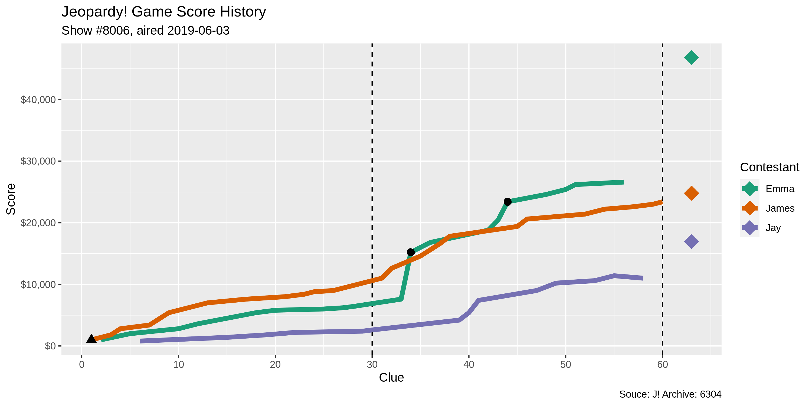

<!-- README.md is generated from README.Rmd. Please edit that file -->

# whatr 

<!-- badges: start -->

[](https://www.tidyverse.org/lifecycle/#maturing)
[](https://CRAN.R-project.org/package=whatr)
[](https://travis-ci.org/kiernann/whatr)
[](https://codecov.io/gh/kiernann/whatr?branch=master')
<!-- badges: end -->

> *This* R package was made to facilitate the analysis of game show data
> by scraping the [J\! Archive](http://j-archive.com/).

> What is… whatr?

## Installation

You can install the development version of ‘whatr’ from
[GitHub](https://github.com/kiernann/whatr) with:

``` r
# install.packages("remotes")
remotes::install_github("kiernann/whatr")
```

## Usage

The `whatr_*()` functions take one of four inputs to find the
appropriate game on the J\! Archive:

1.  An HTML document object from `whatr_html()` or similar.
2.  The numeric, non-sequential game ID.
3.  The sequential show number, as character starting with `#`.
4.  The date an episode originally aired, as `yyyy-mm-dd`.

<!-- end list -->

``` r
library(whatr)
page <- whatr_html("2019-06-03")
whatr_board(page)[, 5:7]
#> # A tibble: 61 x 3
#>    category       clue                                                         answer              
#>    <chr>          <chr>                                                        <chr>               
#>  1 Picture The I… For An Optimistic View Of Things, Take A Look Through These  Rose-Colored Glasses
#>  2 Picture The I… If You Have These, It Means You're Well-Organized            Your Ducks In A Row 
#>  3 Picture The I… It's What's Going On Here                                    Comparing Apples & …
#>  4 Picture The I… Greenhouse Gas Emission Due To Human Activity Leaves Behind… A Carbon Footprint  
#>  5 Picture The I… Note The Lovely Weather; It Means To Take Advantage Of An O… Make Hay While The …
#>  6 Literature     Melville's 'Bartleby The Scrivener' Is Subtitled 'A Story O… Wall Street         
#>  7 Literature     In A 1923 Book By Kahlil Gibran, Almustafa Is This Mystical… The Prophet         
#>  8 Literature     In 'Charlotte's Web', Templeton Is This Creature             A Rat               
#>  9 Literature     In A Novel Simone De Beauvoir Depicted Herself As Anne & Th… (Albert) Camus      
#> 10 Literature     The Title Peak Of This Thomas Mann Novel Is Home To A Swiss… Magic Mountain      
#> # … with 51 more rows
whatr_scores(6304)
#> # A tibble: 63 x 5
#>    round     i name  score double
#>    <int> <int> <chr> <int> <lgl> 
#>  1     1     1 James  1000 TRUE  
#>  2     1     2 Emma   1000 FALSE 
#>  3     1     3 James   800 FALSE 
#>  4     1     4 James  1000 FALSE 
#>  5     1     5 Emma   1000 FALSE 
#>  6     1     6 Jay     800 FALSE 
#>  7     1     7 James   600 FALSE 
#>  8     1     8 James  1000 FALSE 
#>  9     1     9 James  1000 FALSE 
#> 10     1    10 Emma    800 FALSE 
#> # … with 53 more rows
whatr_plot("#8006")
```



## Data

Included in this package is data on the 217 episodes of the show’s 35th
season.

``` r
whatr::episodes
#> # A tibble: 217 x 3
#>     game  show date      
#>    <int> <int> <date>    
#>  1  6096  7816 2018-09-10
#>  2  6097  7817 2018-09-11
#>  3  6098  7818 2018-09-12
#>  4  6099  7819 2018-09-13
#>  5  6101  7820 2018-09-14
#>  6  6102  7821 2018-09-17
#>  7  6103  7822 2018-09-18
#>  8  6105  7823 2018-09-19
#>  9  6106  7824 2018-09-20
#> 10  6107  7825 2018-09-21
#> # … with 207 more rows
whatr::synopses
#> # A tibble: 651 x 6
#>     game name    final coryat right wrong
#>    <int> <chr>   <int>  <int> <int> <int>
#>  1  6096 Rick    20200  18000    23     2
#>  2  6096 Isaac    5200   6400    11     4
#>  3  6096 Caitlin  8800   7800    13     3
#>  4  6097 Rick    29199  17400    24     2
#>  5  6097 Lori    34401  14800    20     2
#>  6  6097 Becky    3200   3200     9     3
#>  7  6098 Lori    17201  14200    18     0
#>  8  6098 Kyle    28401  17200    21     3
#>  9  6098 Monica   8400   6000    14     5
#> 10  6099 Kyle     9599  16000    20     3
#> # … with 641 more rows
```

-----

The ‘whatr’ project is released with a [Contributor Code of
Conduct](https://kiernann.com/whatr/CODE_OF_CONDUCT.html). By
contributing to this project, you agree to its terms.

The J\! Archive is created by fans, for fans. The *Jeopardy\!* game show
and all elements thereof, including but not limited to copyright and
trademark thereto, are the property of Jeopardy Productions, Inc. and
are protected under law. This package is not affiliated with, sponsored
by, or operated by Jeopardy Productions, Inc or the J\! Archive itself.

<!-- refs: start -->

<!-- refs: end -->
